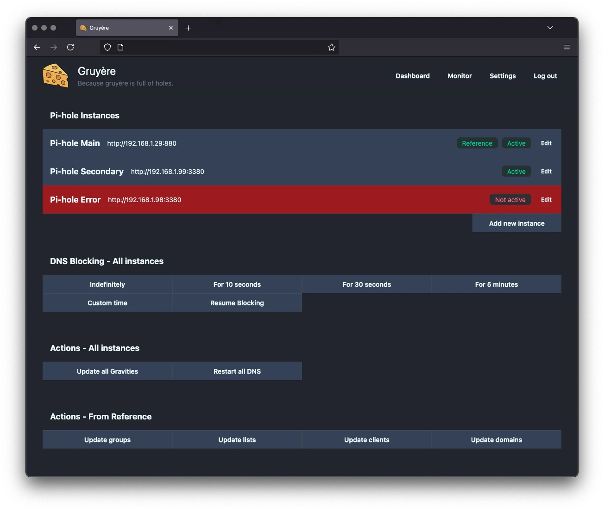

# Gruyere

Because gruyère is full of holes!

Gruyere is a web dashboard for monitoring and syncing multiple Pi-hole instances from a single page (well... two actually). It is designed to be simple, fast, and easy to deploy—just like a good cheese board.

That said, Gruyère is not an alternative UI for Pi-hole: it just handles the synchronisation of instances from a defined reference instance.

## Features

- Apply settings from a reference Pi-Hole instance to all the other instances
- Perform actions on all Pi-hole instances at once (e.g. pause/restart blocking)
- Monitor multiple Pi-hole instances in real time
- See stats like total queries, blocked queries, and more
- Quick status overview for each instance
- Responsive UI, works on desktop and mobile
