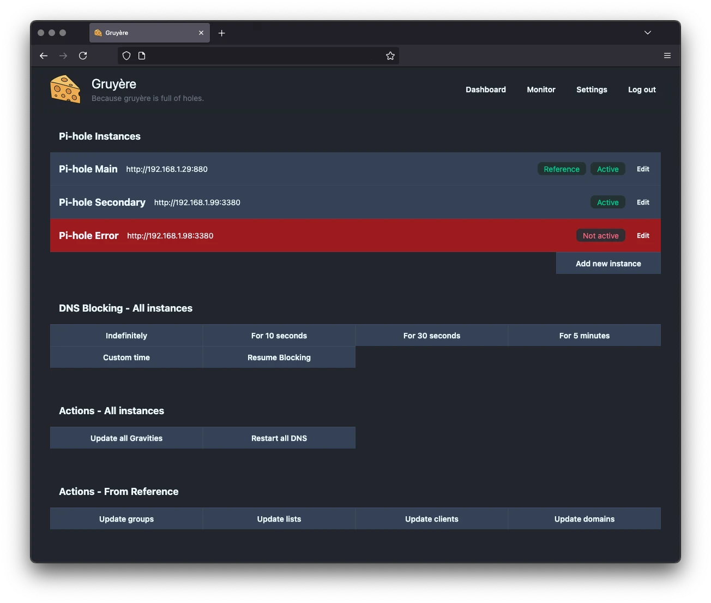

# Gruyere

Because gruyère is full of holes!



Gruyere is a web dashboard for monitoring and syncing multiple Pi-hole instances from a single page (well... two actually). It is designed to be simple, fast, and easy to deploy—just like a good cheese board.

That said, Gruyère is not an alternative UI for Pi-hole: it just handles the synchronisation of instances from a defined reference instance.

## Features

- Apply settings from a reference Pi-Hole instance to all the other instances
- Perform actions on all Pi-hole instances at once (e.g. pause/restart blocking)
- Monitor multiple Pi-hole instances in real time
- See stats like total queries, blocked queries, and more
- Quick status overview for each instance
- Responsive UI, works on desktop and mobile

## Quick Start with Docker

The easiest way to deploy Gruyere is using Docker Compose:

### Prerequisites

- Docker and Docker Compose installed
- Access to your Pi-hole instances and their API keys

### Installation

1. **Clone the repository:**
   ```bash
   git clone https://github.com/yourusername/gruyere.git
   cd gruyere
   ```

2. **Set up configuration files:**
   ```bash
   # Copy template files to create your config
   cp config/password.example.json config/password.json
   cp config/instances.example.json config/instances.json
   cp config/config.example.json config/config.json
   ```

3. **Configure your Pi-hole instances:**

   Edit `config/instances.json` and add your Pi-hole instances:
   ```json
   [
     {
       "id": 1,
       "name": "Pi-hole Main",
       "url": "http://192.168.1.100",
       "apiKey": "your-pihole-api-key-here",
       "isReference": true,
       "sid": "",
       "csrf": "",
       "status": "active"
     }
   ]
   ```

   **Finding your Pi-hole API key:**
   - Log in to your Pi-hole web interface
   - Go to Settings → API / Web interface
   - Click "Show API token" and copy it

4. **Change the default password:**

   Edit `config/password.json`:
   ```json
   {
     "password": "your-secure-password-here"
   }
   ```

5. **Configure environment variables (optional):**

   Create a `.env` file to customize settings:
   ```bash
   cp .env.example .env
   ```

   Edit `.env` and adjust as needed:
   ```bash
   # Set your actual domain/IP
   ORIGIN=http://192.168.1.50:3141

   # Optional: Change port
   PORT=3141

   # Optional: Set log level
   LOG_LEVEL=info
   ```

6. **Start the application:**
   ```bash
   docker-compose up -d
   ```

7. **Access Gruyere:**

   Open your browser and navigate to `http://localhost:3141` (or your configured address)

### Docker Compose Commands

```bash
# Start the container
docker-compose up -d

# Stop the container
docker-compose down

# View logs
docker-compose logs -f

# Rebuild after code changes
docker-compose up -d --build

# Check container status
docker-compose ps

# Restart the container
docker-compose restart
```

## Configuration

### Application Settings

The `config/config.json` file contains application settings:

```json
{
  "isRefreshInstance": true,           // Enable auto-refresh of instance status
  "instanceRefreshInterval": 30,       // Refresh interval in seconds
  "synchronizeWithReference": "partial" // Sync mode: "partial" or "complete"
}
```

### Environment Variables

| Variable | Default | Description |
|----------|---------|-------------|
| `PORT` | `3141` | Port the application listens on |
| `HOST` | `0.0.0.0` | Host binding (0.0.0.0 for all interfaces) |
| `ORIGIN` | `http://localhost:3141` | Origin URL for CORS and security |
| `NODE_ENV` | `production` | Node environment |
| `LOG_LEVEL` | `info` | Log level (fatal, error, warn, info, debug, trace) |

### Security Considerations

1. **Change the default password** immediately after first deployment
2. **Keep API keys secure** - never commit `config/*.json` files (except templates)
3. **Use HTTPS** in production with a reverse proxy (nginx, Traefik, Caddy)
4. **Set correct ORIGIN** to prevent CSRF attacks
5. **Restrict network access** - only expose port 3141 to trusted networks

### Resource Limits

The default docker-compose.yml sets resource limits:
- **CPU**: 1 core max, 0.25 core reserved
- **Memory**: 512MB max, 128MB reserved

Adjust these in `docker-compose.yml` under `deploy.resources` if needed.

## Updating Pi-hole Configurations

Gruyere uses a "reference instance" pattern:

1. Mark one Pi-hole as your **reference instance** (set `isReference: true`)
2. Configure groups, lists, clients, and domains on that instance
3. Use Gruyere to sync those settings to other instances

**Available sync operations:**
- **Update Groups** - Sync group configurations
- **Update Lists** - Sync blocklists and allowlists
- **Update Clients** - Sync client group assignments
- **Update Domains** - Sync domain rules
- **Update Gravity** - Update all instances' blocklists

## Troubleshooting

### Container won't start

Check logs:
```bash
docker-compose logs gruyere
```

Common issues:
- Config files missing - ensure you copied the templates
- Port 3141 already in use - change `PORT` in `.env`
- Permission issues - ensure `./config` directory is writable

### Can't connect to Pi-hole instances

1. **Check network connectivity:**
   ```bash
   docker-compose exec gruyere curl -v http://your-pihole-ip
   ```

2. **Verify API key:**
   - Log in to Pi-hole web interface
   - Go to Settings → API
   - Verify the key matches what's in `instances.json`

3. **Check Pi-hole API is enabled:**
   - Ensure Pi-hole web interface is accessible
   - API should be available at `http://your-pihole/api`

### Instance shows as "unauthorized"

- API key is incorrect or expired
- Edit the instance in Gruyere UI to update the API key
- Gruyere will re-authenticate automatically

### Instance shows as "unreachable"

- Pi-hole is offline or network is unreachable
- Check Pi-hole IP address and port
- Verify firewall rules allow traffic from Gruyere container

## Development

For local development without Docker:

```bash
# Install dependencies
npm install

# Start development server
npm run dev

# Type checking
npm run check

# Linting
npm run lint

# Format code
npm run format

# Build for production
npm run build
```

## Contributing

Contributions are welcome! Please feel free to submit a Pull Request.

## License

MIT
